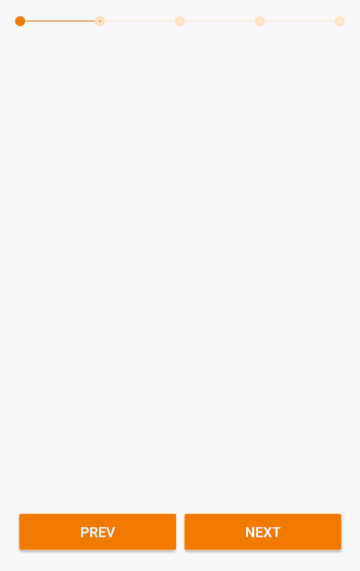

# BreadcrumbsView

[](http://android-arsenal.com/details/1/4475)

A customizable Android view which shows the current step of a given series. Its main purpose is to provide a contextual reference for paginated forms.



## SetUp

Add to top level *gradle.build* file

```gradle
allprojects {
    repositories {
        maven { url "https://jitpack.io" }
    }
}
```

Add to app module *gradle.build* file
```gradle
dependencies {
    compile 'com.github.VictorAlbertos:BreadcrumbsView:0.0.3'
}
```

## Usage

### XML inflation
Define a `BreadcrumbsView` in xml layout as follows:

```xml
  <io.victoralbertos.breadcumbs_view.BreadcrumbsView
      android:id="@+id/breadcrumbs"
      android:layout_width="match_parent"
      android:layout_height="wrap_content"
      app:numberOfSteps="5"
      app:visitedStepBorderDotColor="@color/colorVisited"
      app:visitedStepFillDotColor="@color/colorVisited"
      app:nextStepBorderDotColor="@color/colorNext"
      app:nextStepFillDotColor="@color/colorNext"
      app:visitedStepSeparatorColor="@color/colorVisited"
      app:nextStepSeparatorColor="@color/colorNext"
      app:radiusDot="@dimen/radius_dot"
      app:sizeDotBorder="@dimen/size_dot_border"
      app:heightSeparator="@dimen/height_separator"/>
 ```
 
Among the previous custom attributes, only `app:numberOfSteps` is mandatory, requiring to be an integer value greater than 1.
 
### Moving between steps
Once instantiated the instance of `BreadcrumbsView`, use `breadcrumbs.nextStep()` to move to the next step, and `breadcrumbs.prevStep()` to move to the previous one. If not steps are left to move backward or forward, an `IndexOutOfBoundsException` is thrown.

### Survive config changes
In order to retain the current step between config changes, use `breadcrumbs.setCurrentStep(int)`. You must call it before the view is measured. Otherwise, it throws an `IllegalStateException`.

### Examples
The module [test-sample](https://github.com/VictorAlbertos/BreadcrumbsView/tree/master/test-sample) contains both a minimal example and a UI test driven by Espresso.
